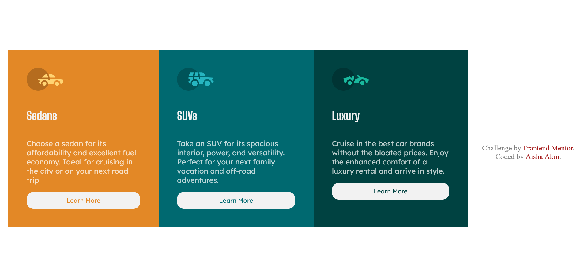

# Frontend Mentor - 3-column preview card component solution

This is a solution to the [3-column preview card component challenge on Frontend Mentor](https://www.frontendmentor.io/challenges/3column-preview-card-component-pH92eAR2-). Frontend Mentor challenges help you improve your coding skills by building realistic projects. 

## Table of contents

- [Overview](#overview)
  - [The challenge](#the-challenge)
  - [Screenshot](#screenshot)
  - [Links](#links)
- [My process](#my-process)
  - [Built with](#built-with)
  - [What I learned](#what-i-learned)

  - [Useful resources](#useful-resources)
  - [AI Collaboration](#ai-collaboration)
- [Author](#author)


## Overview

### The challenge

Users should be able to:

- View the optimal layout depending on their device's screen size
- See hover states for interactive elements

### Screenshot




### Links

- Solution URL: [Add solution URL here](https://your-solution-url.com)
- Live Site URL: [Add live site URL here](https://your-live-site-url.com)

## My process

### Built with

- Semantic HTML5 markup
- CSS custom properties
- Flexbox
- Mobile-first workflow

### What I learned

Use this section to recap over some of your major learnings while working through this project. Writing these out and providing code samples of areas you want to highlight is a great way to reinforce your own knowledge.

To see how you can add code snippets, see below:

```html
<h1>Some HTML code I'm proud of</h1>
```
```css
.body {
   min-height: 100vh;
    display: flex;
    align-items: center;
    flex-direction: column;
    justify-content: center;
}
@media (max-width: 768px) {
    #three_column_box {
        flex-direction: column;
        width: 70%;
    }
} 
```


### Useful resources

- [Example resource 1](https://www.w3school.com) - This helped me for basic CSS properties. I really liked this pattern and will use it going forward.


### AI Collaboration

- What tools did you use: Claude
- How did you use them: debugging, brainstorming my CSS prperties and help me to understand the CSS rule i did

## Author

- Website - [akinsanyaportfolio](https://akinsanyaportfolio.curious.page/) I will create my own personal portfolio website soon
- Frontend Mentor - [@Aishaakin](https://www.frontendmentor.io/profile/Aishaakin)

